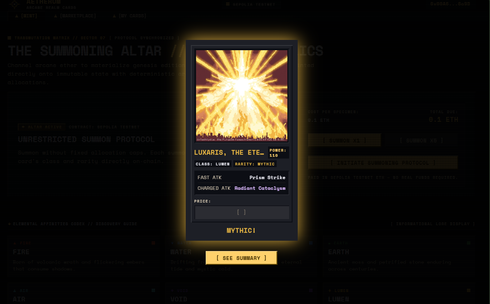
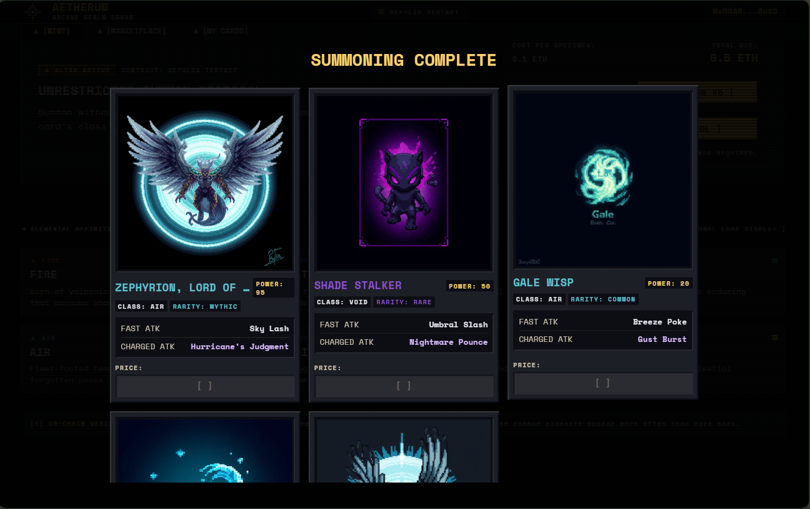
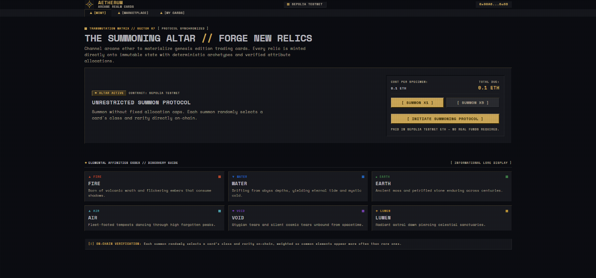
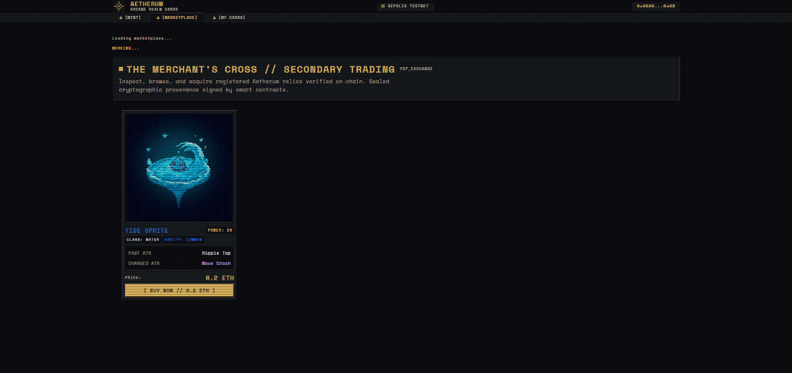
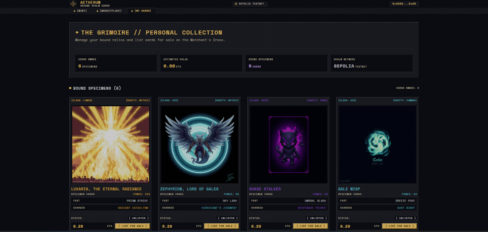
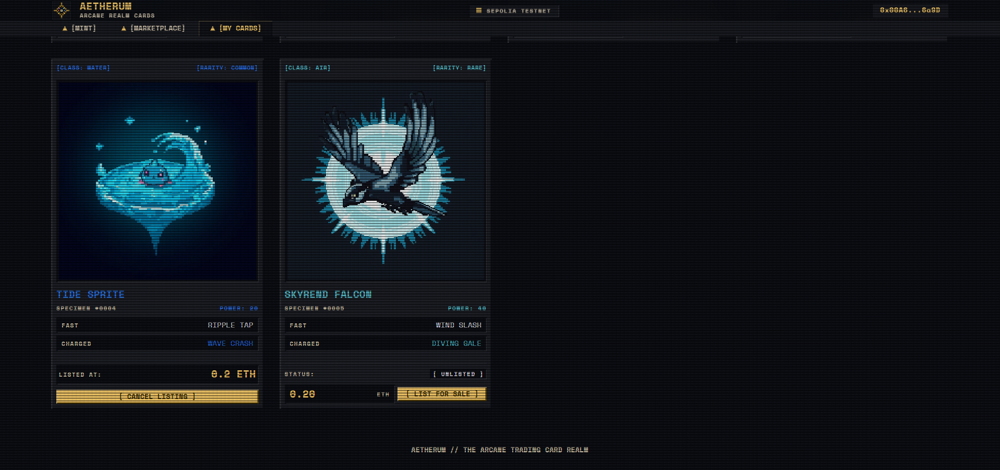

# Aetherum — Arcane Realm Cards

A decentralized NFT trading card marketplace built on the Sepolia testnet. Summon randomized elemental cards on-chain, collect them in your Grimoire, and trade them with other players on the Merchant's Cross.

Built for the GDG Blockchain Team Recruitment — Round 2.

---

## Overview & Features

Aetherum is a full-stack dApp where each card is a genuine ERC-721 NFT with on-chain, weighted-random rarity — no off-chain randomness, no pre-selected mints.

**Core features:**
- **Random summoning** — pay in testnet ETH to "summon" a card; the smart contract picks the class and rarity on-chain using weighted probability (rarer cards are genuinely rarer)
- **6 elemental classes**: Fire, Water, Earth, Air, Void, and Lumen (Void and Lumen are the rarest/strongest, acting as the "legendary" classes)
- **5 rarity tiers** per class: Common, Rare, Epic, Legendary, Mythic — 30 unique cards total
- **Marketplace** — list any card you own for sale, browse listings without needing a wallet connected, and buy listed cards with one click
- **My Cards (The Grimoire)** — view everything your connected wallet owns, list cards for sale, or cancel an existing listing
- **Summon reveal animation** — a Clash-Royale-style one-at-a-time reveal for 5x summons, with a bigger glow effect for rarer pulls
- **IPFS-hosted metadata and artwork** — every card's image and metadata JSON is pinned to IPFS via Pinata

---

## Tech Stack

| Layer | Technology |
|---|---|
| Smart contracts | Solidity 0.8.34, OpenZeppelin Contracts (ERC721URIStorage, Ownable) |
| Dev environment | Hardhat 3 (TypeScript, Mocha, ethers.js) |
| Testnet | Ethereum Sepolia |
| Frontend | React (Vite), ethers.js v6, Tailwind CSS |
| Storage | IPFS via Pinata |
| Wallet | MetaMask (browser extension) |

---

## Setup Instructions

### Prerequisites
- Node.js v18+
- MetaMask browser extension, connected to Sepolia, with test ETH ([Sepolia faucet](https://sepoliafaucet.com/) or similar)

### 1. Clone and install
```bash
git clone <your-repo-url>
cd Aetherum
npm install
cd frontend
npm install
cd ..
```

### 2. Environment variables
Copy the example env files and fill in your own values:
```bash
cp .env.example .env
cp frontend/.env.example frontend/.env
```

`.env` (project root) needs:
- `SEPOLIA_RPC_URL` — from Alchemy, Infura, or a public RPC
- `SEPOLIA_PRIVATE_KEY` — a testnet-only wallet's private key
- `ETHERSCAN_API_KEY` — for contract verification
- `PINATA_JWT` / `PINATA_GATEWAY` — for IPFS uploads

`frontend/.env` needs:
- `VITE_PINATA_GATEWAY` — your Pinata dedicated gateway URL
- `VITE_SEPOLIA_RPC_URL` — a public/backup RPC for read-only marketplace browsing

### 3. Compile & test contracts
```bash
npx hardhat compile
npx hardhat test
```

### 4. Deploy (optional — already deployed, see addresses below)
```bash
npx hardhat ignition deploy ignition/modules/Aetherum.ts --network sepolia
```

### 5. Run the frontend
```bash
cd frontend
npm run dev
```
Open the printed local URL in a browser with MetaMask installed.

---

## Testnet & Contract Addresses

**Network:** Ethereum Sepolia (Chain ID `11155111`)

| Contract | Address | Verified |
|---|---|---|
| AetherumCard (ERC-721) | [`0xB7a2BD8Aab77393DaB84d6dcf774EE308544eBA1`](https://sepolia.etherscan.io/address/0xB7a2BD8Aab77393DaB84d6dcf774EE308544eBA1#code) | Etherscan, Blockscout, Sourcify |
| AetherumMarketplace | [`0xD3bBe3091BCDCB23cEe838C7bB477A9f07C5FA6c`](https://sepolia.etherscan.io/address/0xD3bBe3091BCDCB23cEe838C7bB477A9f07C5FA6c#code) | Etherscan, Blockscout, Sourcify |

**Pricing:** Summon x1 = 0.1 ETH · Summon x5 = 0.5 ETH (Sepolia testnet ETH — no real funds required)

---

## IPFS Implementation

All 30 cards have their artwork and metadata pinned to IPFS via **Pinata**:
- Each card's image is uploaded to IPFS, returning an `ipfs://<CID>` image URI
- A metadata JSON (OpenSea-standard format: `name`, `description`, `image`, `attributes`) is built per card and uploaded separately, returning a second `ipfs://<CID>` — this is the card's `tokenURI`
- All 30 `tokenURI`s are registered directly in the `AetherumCard` contract's storage at deployment, mapped by `class → rarity`
- The frontend resolves `ipfs://` URIs through a Pinata dedicated gateway for fast, reliable loading

Upload script: `scripts/upload-to-ipfs.ts`. Resulting URIs: `metadata/card-uris.json`.

---

## Screenshots

**Summoning a card — the reveal animation:**
Landing on a Mythic pull (Luxaris, the Eternal Radiance) on the very first summon:



**Summoning Complete — summary screen after a x5 summon:**



**The Summoning Altar (Mint screen):**



**The Merchant's Cross (Marketplace):**



**The Grimoire (My Cards) — owned cards with listing controls:**



**My Cards — showing an active listing and cancel option:**



---

## Deployed Link

*(Add your live Vercel URL here once deployed — see deployment steps below.)*

---

## Project Structure

```
Aetherum/
├── contracts/              # Solidity smart contracts
├── test/                   # Hardhat test suite (17 tests)
├── ignition/modules/       # Deployment scripts
├── scripts/upload-to-ipfs.ts
├── metadata/card-uris.json # All 30 cards' on-chain metadata references
├── assets/cards/           # Source card artwork
└── frontend/                # React + Vite frontend
    └── src/App.jsx
```

## Known Limitations (honest disclosure)

- Randomness is generated on-chain using block data (`block.prevrandao`, `block.timestamp`) rather than a verifiable oracle like Chainlink VRF. This is suitable for a testnet/demo project but would need VRF for a production system handling real value.
- "My Cards" refetches on tab visit rather than live-updating via event subscription — a manual tab switch or refresh shows newly summoned cards.
